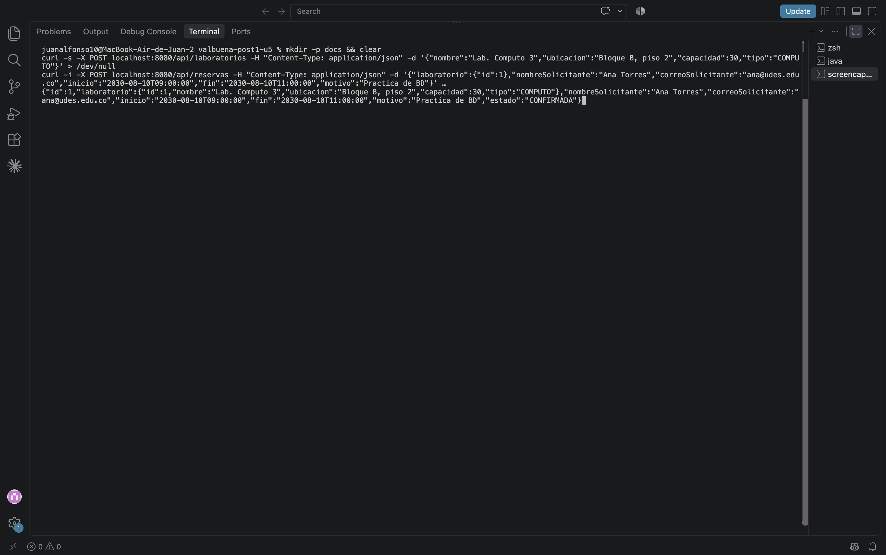
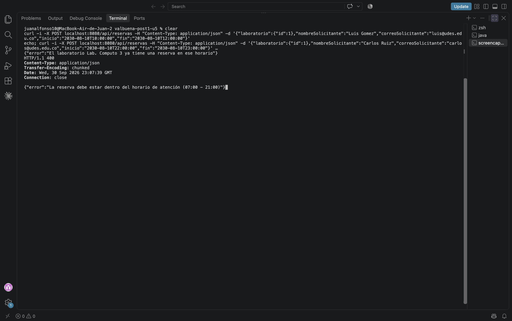
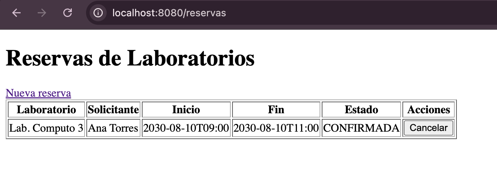
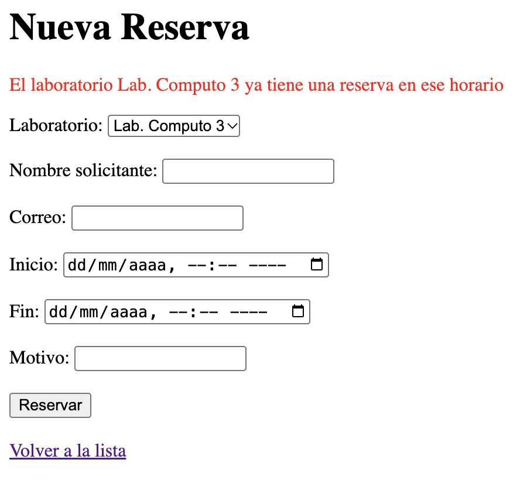

# Post-contenido — Unidad 5: Integración en Aplicaciones Web

## Descripción
Repositorio del post-contenido de la Unidad 5 de Patrones de Diseño de Software. Un único proyecto Spring Boot (`reservas-labs-api`) para reservar laboratorios de cómputo de la universidad, con dos partes:

1. **Parte 1:** API REST en capas (Entity, Repository, Service, Controller) sobre H2.
2. **Parte 2:** vista Thymeleaf (MVC clásico) que reutiliza **el mismo** `ReservaService` de la API REST.

## Arquitectura

| Capa | Paquete | Contenido |
|---|---|---|
| Entidades | `model/` | `Laboratorio`, `Reserva` (`@ManyToOne` hacia `Laboratorio`), `EstadoReserva` |
| Repository | `repository/` | `LaboratorioRepository`, `ReservaRepository` con la consulta JPQL `buscarSolapamientos` |
| Service | `service/` | `ReservaService`: solapamiento, horario de atención, duración y cancelación tardía |
| Controller REST | `controller/` | `ReservaController` (`/api/reservas`), `LaboratorioController` (`/api/laboratorios`) |
| Controller MVC | `web/` | `ReservaWebController` (`/reservas`) + plantillas en `templates/reservas/` |
| Errores | `exception/`, `web/` | Excepciones de dominio, `GlobalRestExceptionHandler` (JSON) y `ReservaWebExceptionHandler` (redirección) |

```
src/main/java/com/universidad/reservaslabs/
├── ReservasLabsApiApplication.java
├── model/        Laboratorio, Reserva, EstadoReserva
├── repository/   LaboratorioRepository, ReservaRepository
├── service/      ReservaService
├── exception/    ReservaConflictException, ReservaInvalidaException,
│                 RecursoNoEncontradoException, GlobalRestExceptionHandler
├── controller/   ReservaController, LaboratorioController        (REST, Parte 1)
└── web/          ReservaWebController, ReservaWebExceptionHandler (MVC, Parte 2)
src/main/resources/templates/reservas/   lista.html, nueva.html
```

## Cómo ejecutar

```bash
mvn clean package
mvn spring-boot:run
```

- API REST: `http://localhost:8080/api/reservas`
- Vista MVC: `http://localhost:8080/reservas`
- Consola H2: `http://localhost:8080/h2-console` (JDBC URL `jdbc:h2:mem:reservas_labs_db`, usuario `sa`)

### Endpoints REST

| Método | Ruta | Respuestas |
|---|---|---|
| GET | `/api/laboratorios` | 200 |
| GET | `/api/laboratorios/{id}` | 200 · 404 |
| POST | `/api/laboratorios` | 201 · 400 |
| GET | `/api/reservas` | 200 |
| GET | `/api/reservas/{id}` | 200 · 404 |
| GET | `/api/reservas/laboratorio/{laboratorioId}` | 200 |
| POST | `/api/reservas` | 201 · 400 (horario, duración o datos inválidos) · 404 (laboratorio) · 409 (solapamiento) |
| DELETE | `/api/reservas/{id}` | 204 · 404 · 409 (inicio ya pasó) |

### Rutas MVC

| Método | Ruta | Vista / resultado |
|---|---|---|
| GET | `/reservas` | `reservas/lista`: tabla de reservas con botón para cancelar |
| GET | `/reservas/nueva` | `reservas/nueva`: formulario con el combo de laboratorios |
| POST | `/reservas` | Crea y redirige a `/reservas`; si hay error, vuelve a `/reservas/nueva` con el mensaje |
| POST | `/reservas/{id}/cancelar` | Cancela y redirige a `/reservas` |

## Evidencias

Los checkpoints están automatizados. Corre `mvn test`:

- **`ReservaControllerTest` (REST):** 201 en horario libre, 409 por solapamiento, 400 fuera de horario, 400 por duración mayor a 3 horas, 400 por validación, 404 por laboratorio inexistente, y que cancelar libera el horario.
- **`ReservaWebControllerTest` (MVC):** las vistas se renderizan; crear desde el formulario redirige con mensaje; una reserva solapada o fuera de horario vuelve al formulario con **el mismo mensaje** que devuelve la API REST.

**API REST — reserva creada (201)**


**API REST — solapamiento (409) y fuera de horario (400)**


**Vista MVC — lista de reservas**


**Vista MVC — reserva solapada: mismo mensaje de negocio que la API**


## Decisiones de diseño

### Punto de decisión 1 — Ubicación de la validación de solapamiento
El **filtrado** vive en `ReservaRepository.buscarSolapamientos`, una consulta JPQL que busca, en la base de datos, las reservas no canceladas del mismo laboratorio cuyo rango `[inicio, fin)` se cruza con el nuevo. La **decisión** vive en `ReservaService.crear` (línea 59): si la lista no está vacía, lanza `ReservaConflictException` con un mensaje claro. El Repository responde una pregunta de datos ("¿qué reservas se solapan con este rango?") y el Service una pregunta de negocio ("¿se permite crear esta reserva?"). Filtrar en memoria obligaría a traer todas las reservas del laboratorio, que crecen sin límite con el tiempo.

Si el Controller llamara directamente a `buscarSolapamientos()`, la regla quedaría en la capa HTTP. La vista MVC de la Parte 2 tendría que copiarla, y la validación de horario y duración podría saltarse según qué controlador se usara.

### Punto de decisión 2 — Reglas con y sin apoyo del Repository
El criterio: **si la regla necesita comparar contra datos que solo la base de datos conoce (otras reservas), se apoya en una consulta del Repository. Si solo depende del objeto que se está validando, se resuelve en el Service con Java puro.** El horario de atención (07:00–21:00) y la duración (30 min a 3 h) dependen únicamente de `inicio` y `fin` de la reserva que llega, así que `validarHorarioYDuracion` (línea 83) no toca la base de datos. Además, se ejecuta **antes** que la consulta de solapamiento (línea 55), para no ir a la base de datos con una reserva que ya es inválida por sí misma.

Estas reglas lanzan `ReservaInvalidaException` (**400**), no `ReservaConflictException` (409). Una reserva a las 22:00 no choca con nadie: la petición en sí es inválida. El 409 queda reservado para el conflicto con otra reserva existente.

**Nota sobre `LaboratorioController`:** es la única excepción intencional a "el Controller nunca toca el Repository". El catálogo de laboratorios es un CRUD sin ninguna regla de negocio propia; un `LaboratorioService` que solo delegara sería el mismo Service anémico que este laboratorio pide evitar. La capa Service se introduce cuando hay una regla que la justifique, como en `ReservaService`, no por seguir la plantilla de capas de forma mecánica.

### Punto de decisión 3 — Cómo comparten el Service el controlador MVC y el REST
`ReservaController` (línea 16) y `ReservaWebController` (línea 18) reciben por constructor **la misma clase `ReservaService`**, que Spring gestiona como un único bean singleton. Ninguno de los dos controladores reimplementa el solapamiento, el horario ni la duración: `ReservaWebController.crear` solo llama a `service.crear(reserva)`. Se descartó crear un segundo `ReservaWebService` o copiar la validación en el controlador MVC, porque corregir una regla (por ejemplo, cambiar la duración máxima) obligaría a cambiarla en dos lugares y, tarde o temprano, las dos superficies responderían distinto. `ReservaWebControllerTest` lo verifica: la reserva solapada en MVC produce exactamente el mismo mensaje que la API REST.

### Punto de decisión 4 — Manejo de errores consistente entre MVC y REST
Hay **dos manejadores**, cada uno restringido a su superficie:
- `GlobalRestExceptionHandler`: `@RestControllerAdvice(annotations = RestController.class)`. Responde JSON con 404 / 409 / 400.
- `ReservaWebExceptionHandler`: `@ControllerAdvice(assignableTypes = ReservaWebController.class)`. Redirige al formulario (o a la lista) con el mensaje en un atributo flash.

Un único `@RestControllerAdvice` serializaría siempre a JSON, y una página Thymeleaf necesita una redirección con un mensaje legible. Un solo manejador que "detecte" el cliente mirando el header `Accept` es posible, pero añade una rama condicional por cada excepción. Con dos manejadores se mantiene la misma separación del resto del proyecto (una clase por superficie de presentación), y ambos parten del **mismo vocabulario de excepciones de dominio**: `ReservaConflictException`, `ReservaInvalidaException` y `RecursoNoEncontradoException`.

## Herramientas utilizadas
- Java 17, Spring Boot 3.2, Spring Data JPA, H2, Thymeleaf, Bean Validation
- JUnit 5, MockMvc
- Apache Maven, curl, Git, GitHub

## Conclusiones
La capa Service se justificó por las reglas que contiene, no por la plantilla: `ReservaService` decide el solapamiento, el horario y la cancelación tardía, mientras que `LaboratorioController` usa el Repository directamente porque su catálogo no tiene reglas. Lo más difícil fue ubicar la regla de solapamiento, que necesita datos de la base pero es una decisión de negocio; la respuesta fue dividirla entre una consulta en el Repository y la decisión en el Service. Esa división pagó en la Parte 2: la vista Thymeleaf se agregó sin tocar una sola regla, y distinguir entre "petición inválida" (400) y "conflicto con otra reserva" (409) permitió que ambas superficies presentaran los mismos errores de forma distinta pero consistente.
